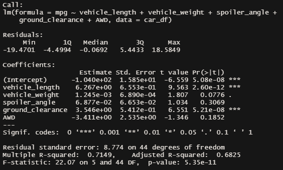
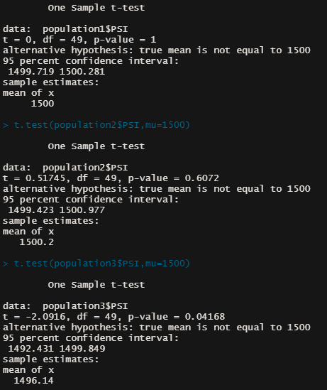

# MechaCar_Statistical_Analysis

## Linear Regression to Predict MPG

### Which variables/coefficients provided a non-random amount of variance to the mpg values in the dataset?
The intercept, vehicle length, and ground clearance all had significantly small pr(>|t|) values. That means they are more likely to provide random amounts of variance to the linear model. 
### Is the slope of the linear model considered to be zero? Why or why not?
No, the slop is not zero because the p-value is significantly smaller than the significance level of 0.05%. Meaning that we can't reject the null hypothesis.
### Does this linear model predict mpg of MechaCar prototypes effectively? Why or why not?
I don't think that this model predicts the mpg effectively because the r-squared value is at 0.71. I think that the model is either missing a significant variable, or there's too many variables.

## Summary Statistics on Suspension Coils

### The design specifications for the MechaCar suspension coils dictate that the variance of the suspension coils must not exceed 100 pounds per square inch. Does the current manufacturing data meet this design specification for all manufacturing lots in total and each lot individually? Why or why not?
The variance passes for all manufacturing lots combined with a variance of 62.29 pound per square inch. For individual lots, lots 1 and 2 both pass, but lot 3 does not with a variance of 170.29 pounds per square inch.

## T-Tests on Suspension Coils

The populations for lots 1 and 2 both had p-values above a significance level of 0.05, therefore the null hypothesis can't be rejected and we can deem the means similar to the population mean. The p-value for lot 3 was below the significance level at 0.04, therefore we can reject the null hypothesis and deem it not similar.
## Study Design: MechaCar vs Competition
To compare MechaCar to its competitors, I would use variable such as: fuel efficiency, cost, safety rating, and drive terrain. The variable we would try to find would be customer ratings. The null hypothesis would be that fuel efficiency, cost, safety rating, and drive terrain have no effect on the customer's rating. The alternative hypothesis would be that those variable do have a significant effect on the customer's rating. I would like to try a multiple linear regression with those variable to see if there would be a formable equation that fits. We would need the data from the vehicle specifications listed, as well as the customer's ratings of each vehicle.
